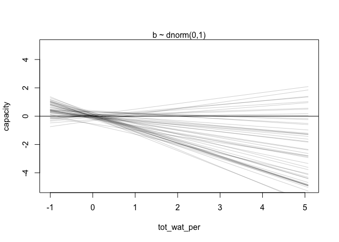
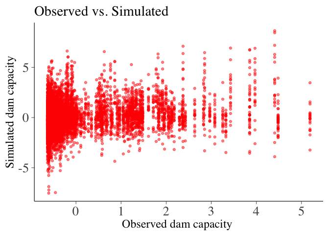
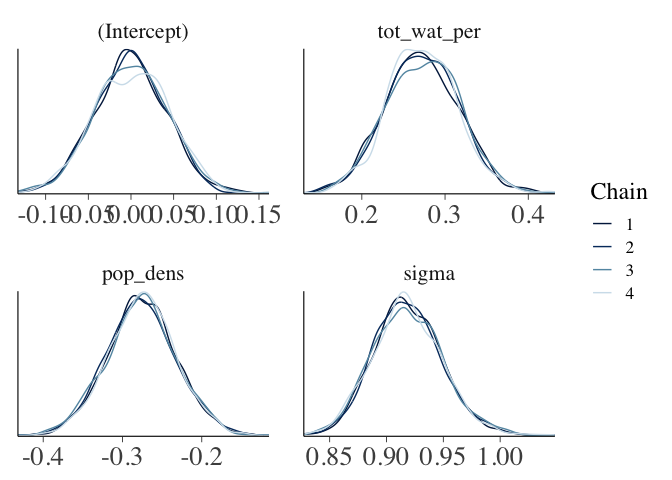
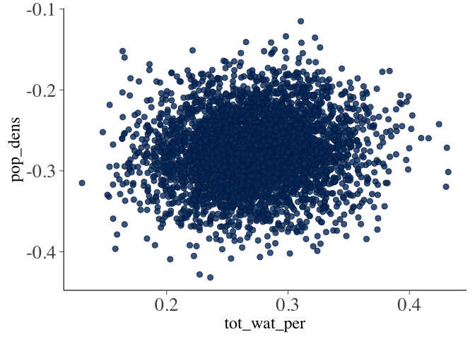
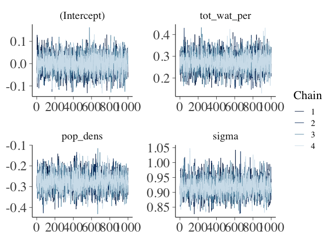
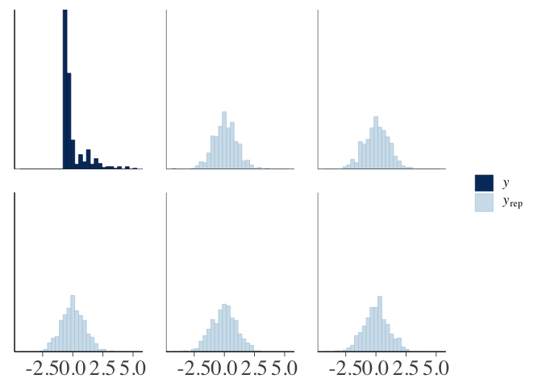
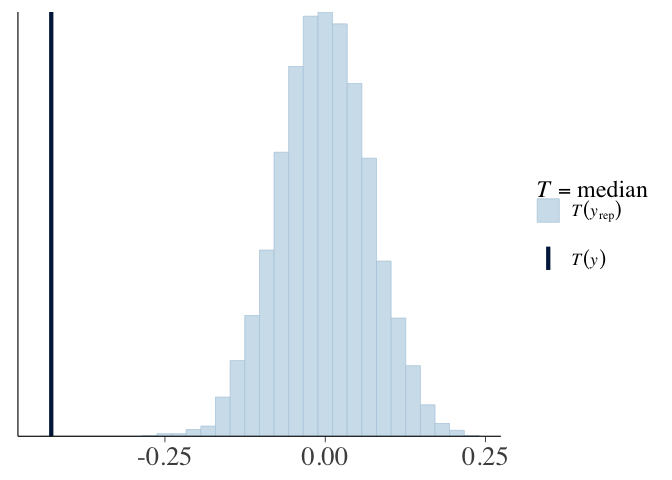
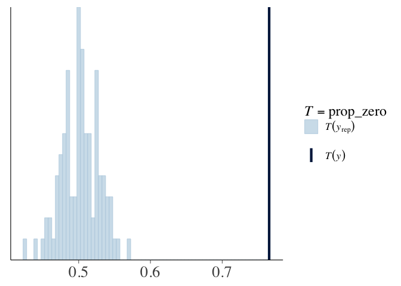
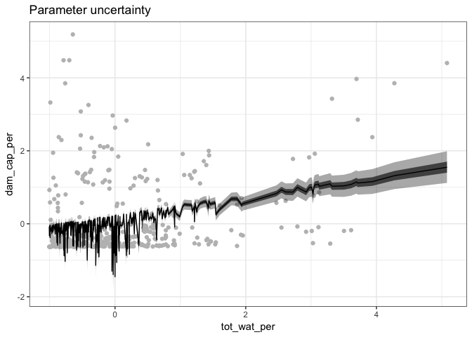

Applied Bayesian Statistics
================
Marius Derenthal

introduction
============

This document describes the workflow for the "Water Demand and Supply – a Jevons Paradox?" analysis. In contains code and selected plots.

Inspired, and partly duplicated, from Cornelius Senf, Jonah Gabry, Ben Goodrich, Gergana and Maxwell Farrell

usefull links
=============

<https://mran.revolutionanalytics.com/snapshot/2018-01-06/web/packages/rstanarm/vignettes/continuous.html> <https://cran.r-project.org/web/packages/rstanarm/> <https://cran.r-project.org/web/packages/bayesplot/> <https://ourcodingclub.github.io/2018/04/30/stan-2.html> <https://arxiv.org/pdf/1709.01449.pdf> <https://github.com/jgabry/bayes-vis-paper/blob/master/bayes-vis.R>

workflow
========

1.  data preporcessing
2.  data exploration
3.  prior predictive simulations and prior selection
4.  fit various models
5.  model comparison
6.  MCMC draws and diagnostics
7.  graphical posterior predictive checks (PPCs)
8.  regression model

setup
=====

packages
--------

``` r
library(rstan)
library(bayesplot)
library(tidyverse)
library("rethinking")
library(reshape2)
library(rstanarm)
library(corrplot)
library("PerformanceAnalytics")
rstan_options(auto_write = TRUE)
library(cowplot)
```

functions
---------

``` r
as.numeric.factor <- function(x) {as.numeric(levels(x))[x]}
```

working directory
-----------------

``` r
parent <- getwd()
data_path = file.path(parent , 'Data')
output_path = file.path(parent, 'output')
ifelse(!dir.exists(output_path), dir.create(file.path(output_path)), FALSE)
```

analysis
========

0. load data
------------

``` r
africa <- read.csv2("Data/africa_flat.csv", header = T)
america <- read.csv2("Data/americas_flat.csv", header = T)
asia <- read.csv2("Data/asia_flat.csv", header = T)
europe <- read.csv2("Data/europe_flat.csv", header = T)
ocean <- read.csv2("Data/ocean_flat.csv", header = T)

data = rbind(africa,america,asia,europe,ocean)
```

1. data preprocessing
---------------------

### 1.1 additional variables

``` r
dam_cap <- subset(data, Variable.Id == 4197)      #total dam capacity
dam_cap_per <- subset(data, Variable.Id == 4471)  #dam capacity per capita
  
tot_wat <- subset(data, Variable.Id == 4253)      #total water withdrawl
tot_wat_per <- subset(data, Variable.Id == 4257)  #total water withdrawl per capita
agr_wat <- subset(data, Variable.Id == 4250)      #agricultural withdrawl
ind_wat <- subset(data, Variable.Id == 4252)      #industrial withdrawl
  
pop_tot <- subset(data, Variable.Id == 4104)      #total population
pop_dens <- subset(data, Variable.Id == 4107)     #population density
pop_under <- subset(data, Variable.Id == 4474)    #prevalence of undernourishment 
pop_access <- subset(data, Variable.Id == 4114)   #Total population with access to safe drinking-water
  
irri1 <- subset(data, Variable.Id == 4328)        #% of the area equipped for irrigation actually irrigated
irri2 <- subset(data, Variable.Id == 4330)        #% of irrigation potential equipped for irrigation
```

### 1.2 subsetting and further wrangling

``` r
data_sub <- rbind(dam_cap,dam_cap_per,
                  tot_wat,tot_wat_per,agr_wat,ind_wat,
                  pop_tot,pop_dens,pop_under,pop_access,
                  irri1,irri2)
  
#remove columns
data_sub_long <- data_sub[,-c(2,4,7:8)]
  
#transform to wide format
data_sub_wide <-data_sub_long %>% 
  dplyr::group_by_at(vars(c(-Value))) %>%             # group by everything other than the value column. 
  dplyr::mutate(row_id=1:n()) %>% ungroup() %>%       # build group index
  spread(key=Variable.Name , value =Value) %>%        # spread
  dplyr::select(-row_id)                              # drop the index
  
  
#aggreagate data into AQUASTAT timesteps
#create bins
data_sub_wide$bins <- cut(data_sub_wide$Year, 
                          breaks=seq(from = 1958, to = 2018, 5), 
                          labels=seq(from = 1960, to = 2015, 5))
  
data_sub_wide <- data_sub_wide[,-2]
  
#calculate mean based on bins
data_sub_wide_mean <- data_sub_wide %>%
  group_by(Area, bins) %>%
  summarize(dam_cap = mean(`Total dam capacity`, na.rm = TRUE),
            dam_cap_per = mean(`Dam capacity per capita`, na.rm = TRUE),
    
            tot_wat = mean(`Total water withdrawal`, na.rm = TRUE),
            tot_wat_per = mean(`Total water withdrawal per capita`, na.rm = TRUE),
            agr_wat = mean(`Agricultural water withdrawal`, na.rm = TRUE), 
            ind_wat = mean(`Industrial water withdrawal`, na.rm = TRUE),
            
            pop_tot = mean(`Total population`, na.rm = TRUE),
            pop_dens = mean(`Population density`, na.rm = TRUE),
            pop_under = mean(`Prevalence of undernourishment (3-year average)`, na.rm = TRUE),
            pop_access = mean(`Total population with access to safe drinking-water (JMP)`, na.rm = TRUE),
            
            irri1 = mean(`% of irrigation potential equipped for irrigation`, na.rm = TRUE),
            irri2 = mean(`% of the area equipped for irrigation actually irrigated`, na.rm = TRUE))
  
dat <- data_sub_wide_mean

# create subset for analysis
sub_tot <- dat[,c(1,2,4,6,10,11,12)] # all variables of interest
sub_1 <- dat[,c(1,2,4)] # Area, bins, dam_cap_per
sub_2 <- dat[,c(1,2,6)] # Area, bins, withdrawal_per
sub_2.1 <- dat[,c(1,2,4,6)] # Area, bins,dam_cap_per, withdrawal_per
sub_3 <- dat[,c(1,2,4,6,10)] # Area, bins, dam_cap_per, withdrawal_per, pop_dens
sub_4 <- dat[,c(1,2,11)] # Area, bins, pop_under
sub_5 <- dat[,c(1,2,12)] # Area, bins, pop_access
sub_5.1 <- dat[,c(1,2,4,6,12)] # Area, bins, pop_access

# choose subest to work with
sub <- sub_3
  
# filter out countires & remove NAs
sub <- subset(sub, !Area %in% c("SUR|Suriname",
                              "TKM|Turkmenistan",
                              "ISL|Iceland",
                              "CAN|Canada",
                              "SGP|Singapore",
                              "BGD|Bangladesh","GHA|Ghana"))
sub_na <- na.omit(sub)
sub_na <- subset(sub_na, dam_cap_per > 0)

print(paste("Number of Countries included after subsetting: ",length(unique(sub_na$Area))))
```

    ## [1] "Number of Countries included after subsetting:  138"

``` r
#calulate data availability
data_size<- sub_na %>%
group_by(Area) %>%
summarise(count=n())
print(paste("Mean number of observations per country: ",round(mean(data_size$count), digits = 2)))
```

    ## [1] "Mean number of observations per country:  3.28"

### 1.3 z-score normalisation

``` r
#z-score normalisation
dat_z <- sub_na
# names of variables I don't want to scale
varnames <- c("Area", "bins")
# index vector of columns which must not be scaled
index <- names(dat_z) %in% varnames
# scale only the columns not in index
temp <- scale(dat_z[, !index])
dat_z[, !index] <- temp


#min-max normalisation 
dat_norm <- sub_na
varnames <- c("Area", "bins")
index <- names(dat_norm) %in% varnames
temp <- as.data.frame(lapply(dat_norm[, !index], normalize))
dat_norm[, !index] <- temp

#choose data set
sub_na = dat_z
```

2. data exploration
-------------------

``` r
#histograms
hist(sub_na$tot_wat_per, nclass = 100)
```


``` r
hist(sub_na$dam_cap_per,nclass = 100)
```


``` r
hist(sub_na$pop_dens,nclass = 100)
```


``` r
ggplot(sub_na, aes(x=tot_wat_per, y= dam_cap_per)) + 
  geom_point() +
  #scale_y_log10() + 
  #scale_x_log10() +
  labs(y="Dam capacity per capita", 
       x="Total water withdrawal per capita", 
       title="Supply-Demand Relationship")
```


``` r
ggplot(sub_na, aes(x=pop_dens, y= dam_cap_per, col = bins)) +
  geom_point() +
  #scale_y_log10() + 
  #scale_x_log10() +
  labs(y="Dam capacity per capita", 
       x="Population density", 
       title="Supply-Demand Relationship")
```


``` r
ggplot(sub_na, aes(x=bins, y= dam_cap_per)) + 
  geom_point() +
  #scale_y_log10() + 
  #scale_x_log10() +
  labs(y="Dam capacity per capita", 
       x="bins", 
       title="Supply-Demand Relationship")
```


3. prior predictive simulations
-------------------------------

``` r
curve( dnorm( x , 0 , 1 ) , from= -5 , to = 5 )
```


``` r
curve( dcauchy( x , 0 , 1 ) , from= -5 , to= 5 )
```


``` r
# beta 1 
N <- 50                   
a <- rnorm( N , 0 , 0.2)
b <- rnorm( N , 0.5, 0.5 )
plot( NULL , xlim=range(sub_na$tot_wat_per) , ylim=c(-5,5) ,
      xlab="tot_wat_per" , ylab="capacity" )
abline( h=0 , lty=1 )
abline( h=0 , lty=1 , lwd=0.5 )
mtext( "b ~ dnorm(0,1)" )
xbar <- mean(sub_na$tot_wat_per)

for ( i in 1:N ) curve( a[i] + b[i]*(x - xbar) ,
                        from=min(sub_na$tot_wat_per) , to=max(sub_na$tot_wat_per) , add=TRUE ,col=col.alpha("black",0.2) )
```


``` r
# beta 2  
N <- 50                   
a <- rnorm( N , 0 , 0.2)
b <- rnorm( N , -0.5, 0.5 )
plot( NULL , xlim=range(sub_na$tot_wat_per) , ylim=c(-5,5) ,
      xlab="tot_wat_per" , ylab="capacity" )
abline( h=0 , lty=1 )
abline( h=0 , lty=1 , lwd=0.5 )
mtext( "b ~ dnorm(0,1)" )
xbar <- mean(sub_na$pop_dens)
for ( i in 1:N ) curve( a[i] + b[i]*(x - xbar) ,
                        from=min(sub_na$tot_wat_per) , to=max(sub_na$tot_wat_per) , add=TRUE ,col=col.alpha("black",0.2))
```



``` r
rm(data_all)
data_all <- data.frame()


N= 20
for (i in 1:N){
  
  Nsim = length(sub_na$tot_wat_per) 
  
  sigma <- abs(rnorm(1, 0, 1))
  beta0 <- rnorm(1, 0, 0.2)
  beta1 <- rnorm(1, 0.5, 0.5)
  beta2 <- rnorm(1, -0.5, 0.5)
  
  data1 <- data.frame(
  tot_cap = sub_na$tot_wat_per,
  dam_cap = sub_na$dam_cap_per,
  pop_d = sub_na$pop_dens,
  
  sim_tot= beta0 + beta1* sub_na$tot_wat_per + beta2*sub_na$pop_dens + rnorm(Nsim, mean = 0, sd = sigma),
  sim_with = beta0 + beta1 * sub_na$tot_wat_per + rnorm(Nsim, mean = 0, sd = sigma),
  sim_dens =  beta0 + beta2* sub_na$pop_dens + rnorm(Nsim, mean = 0, sd = sigma)
  )

data_all <- rbind(data_all,data1) 
}

theme_set(bayesplot::theme_default(base_size = 18))
theme_update(axis.text = element_text(size = 20))

p_comp <- ggplot(data_all, aes(x = dam_cap, y = sim_tot)) + 
  geom_point(alpha = 0.5, color = "red") +
  labs(title = "Observed vs. Simulated",
       x = "Observed dam capacity ",
       y = "Simulated dam capacity")#, 


p_tot <- ggplot(data_all, aes(x = tot_cap, y = sim_tot)) + 
  geom_point(alpha = 0.5, color = "red") +
  labs(title = "Multiple Regression",
       x = "Additive predictors",
       y = "Simulated dam capacity")


p_dens <- ggplot(data_all, aes(x = pop_d, y = sim_dens)) + 
geom_point(alpha = 0.5, color = "blue") +
labs(title = "Simple Regression",
     x = "Population Density",
     y = "Simulated dam capacity")


p_with <- ggplot(data_all, aes(x = tot_cap, y = sim_with)) + 
 geom_point(alpha = 0.5, color = "blue") +
 labs(title = "Simple Regression",
      x = "Total water withdrawal per capita",
      y = "Simulated dam capacity")

 
p_dens
```


``` r
p_with
```


``` r
p_tot
```


``` r
p_comp
```



``` r
#create prior for model fit
my_prior <- normal(location = c(0.5, -0.5), scale = c(0.5, 0.5), autoscale = FALSE)
```

4. fit various models
---------------------

``` r
#Null model
fit0 <- stan_glm(dam_cap_per ~ 1,
                 data = sub_na,  
                 prior_intercept = normal(0, 0.2),
                 family = gaussian(link = "identity"))


#Simple linear mdel
fit1 <- stan_glm(dam_cap_per ~ tot_wat_per,
                 data = sub_na,
                 prior = normal(1, 0.5),
                 prior_intercept = normal(0, 0.2),
                 prior_aux = normal(0, 1),
                 family = gaussian(link = "identity"))
                   
                   
#Multiple linear model  
fit1.1 <- stan_glm(dam_cap_per ~ tot_wat_per + pop_dens,
                   data = sub_na,  
                   prior = my_prior,
                   prior_intercept = normal(0, 0.2),
                   prior_aux = normal(0, 1),
                   QR = TRUE,
                   family = gaussian(link = "identity"))
```

5. model comparison
-------------------

``` r
loo0 <- loo(fit0)
loo1 <- loo(fit1)
loo1.1 <- loo(fit1.1)
  
(comp <- compare_models(loo0,loo1,loo1.1))       
```

    ## 
    ## Model comparison: 
    ## (ordered by highest ELPD)
    ## 
    ##        elpd_diff se_diff
    ## fit1.1   0.0       0.0  
    ## fit1   -18.5       2.8  
    ## fit0   -38.2      10.4

``` r
#choose model based on comparison
fit <- fit1.1
summary(fit)
```

    ## 
    ## Model Info:
    ## 
    ##  function:     stan_glm
    ##  family:       gaussian [identity]
    ##  formula:      dam_cap_per ~ tot_wat_per + pop_dens
    ##  algorithm:    sampling
    ##  priors:       see help('prior_summary')
    ##  sample:       4000 (posterior sample size)
    ##  observations: 452
    ##  predictors:   3
    ## 
    ## Estimates:
    ##                 mean   sd     2.5%   25%    50%    75%    97.5%
    ## (Intercept)      0.0    0.0   -0.1    0.0    0.0    0.0    0.1 
    ## tot_wat_per      0.3    0.0    0.2    0.2    0.3    0.3    0.4 
    ## pop_dens        -0.3    0.0   -0.4   -0.3   -0.3   -0.2   -0.2 
    ## sigma            0.9    0.0    0.9    0.9    0.9    0.9    1.0 
    ## mean_PPD         0.0    0.1   -0.1    0.0    0.0    0.0    0.1 
    ## log-posterior -604.3    1.4 -608.0 -605.0 -603.9 -603.2 -602.5 
    ## 
    ## Diagnostics:
    ##               mcse Rhat n_eff
    ## (Intercept)   0.0  1.0  5775 
    ## tot_wat_per   0.0  1.0  5206 
    ## pop_dens      0.0  1.0  5421 
    ## sigma         0.0  1.0  4551 
    ## mean_PPD      0.0  1.0  4714 
    ## log-posterior 0.0  1.0  1647 
    ## 
    ## For each parameter, mcse is Monte Carlo standard error, n_eff is a crude measure of effective sample size, and Rhat is the potential scale reduction factor on split chains (at convergence Rhat=1).

``` r
#prior_summary(fit)
```

6. MCMC draws and diagnostics
-----------------------------

``` r
# posterior uncertainty intervals
  mcmc_intervals(as.array(fit), pars = c("(Intercept)", "tot_wat_per","pop_dens", "sigma")) #Central posterior uncertainty intervals
```


``` r
  mcmc_areas(as.array(fit), pars = c("(Intercept)", "tot_wat_per","pop_dens", "sigma"))
```


``` r
  posterior_interval(as.matrix(fit), prob = 0.9, type = "central",
                     pars = c("(Intercept)", "tot_wat_per","pop_dens", "sigma"))
  
  
  # univariate marginal posterior distributions
  mcmc_hist(as.array(fit), pars = c("(Intercept)", "tot_wat_per","pop_dens", "sigma")) #plots marginal posterior distributions (combining all chains):
```


``` r
  mcmc_hist_by_chain(as.array(fit), pars = c("(Intercept)", "tot_wat_per","pop_dens", "sigma")) #view separate histograms of each of the four Markov chains
```


``` r
  mcmc_dens_overlay(as.array(fit), pars = c("(Intercept)", "tot_wat_per","pop_dens", "sigma"))
```



``` r
  mcmc_violin(as.array(fit), pars = c("(Intercept)", "tot_wat_per","pop_dens", "sigma"))
```


``` r
  # bivariate plots
  mcmc_scatter(as.array(fit), pars = c( "tot_wat_per","pop_dens"))
```



``` r
  mcmc_hex(as.array(fit), pars = c( "tot_wat_per","pop_dens"))
```


``` r
  mcmc_pairs(as.array(fit), pars = c("(Intercept)", "tot_wat_per","pop_dens", "sigma"))
```


``` r
  # trace plots
  mcmc_trace(as.array(fit), pars = c("(Intercept)", "tot_wat_per","pop_dens", "sigma")) 
```



``` r
  mcmc_trace(as.array(fit), pars = c("(Intercept)", "tot_wat_per","pop_dens", "sigma"), 
             facet_args = list(ncol = 1, strip.position = "left"))
```


7. graphical posterior predictive checks (PPCs)
-----------------------------------------------

``` r
posterior_draws <- posterior_predict(fit, draws = 100)
ppc_dens_overlay(y = fit$data$dam_cap_per, yrep = posterior_draws)
```


``` r
pp_check(fit, plotfun = "hist", nreps = 5)
```



``` r
pp_check(fit, plotfun = "stat", stat = "mean")
```


``` r
pp_check(fit, plotfun = "stat", stat = "median")
```



``` r
#Distributions of test statistics 
prop_zero <- function(x) mean(x <= 0)
prop_zero(fit$data$dam_cap_per)
prop_zero(posterior_draws)
  
ppc_stat(fit$data$dam_cap_per, posterior_draws, stat = "prop_zero", binwidth = 0.005)
```



8. regression model
-------------------

``` r
n_draws <- 4000

# Draw from the linear predictor, no residual variance
posterior_line_draws <- posterior_linpred(fit, draws = n_draws) 

posterior_line_draws_plot <- posterior_line_draws %>%
  as.data.frame(.) %>%
  gather(.) %>%
  mutate(draw = rep(1:n_draws, length(fit$data$tot_wat_per)),
         x = rep(fit$data$tot_wat_per, each = n_draws))

ggplot(posterior_line_draws_plot %>% 
         filter(draw %in% sample(1:n_draws, 30))) +
  geom_point(data = sub_na, aes(x = tot_wat_per, y = dam_cap_per), col = "grey") +
  geom_line(aes(x = x, y = value, group = draw), alpha = 0.3) +
  theme_bw()
```


``` r
posterior_line_draws_plot_summary <- posterior_line_draws_plot %>%
  group_by(x) %>%
  summarize(q025 = quantile(value, 0.025),
            q25 = quantile(value, 0.25),
            q50 = quantile(value, 0.5),
            q75 = quantile(value, 0.75),
            q975 = quantile(value, 0.975))

ggplot(posterior_line_draws_plot_summary) +
  geom_point(data = sub_na, aes(x = tot_wat_per, y = dam_cap_per), col = "grey") +
  geom_ribbon(aes(x = x, ymin = q025, ymax = q975), alpha = 0.4) +
  geom_ribbon(aes(x = x, ymin = q25, ymax = q75), alpha = 0.8) +
  geom_line(aes(x = x, y = q50)) +
  theme_bw() +
  labs(title = "Parameter uncertainty")
```



``` r
# Draw from the whole model with residual variance
posterior_draws <- posterior_predict(fit, draws = n_draws) 

posterior_draws_plot <- posterior_draws %>%
  as.data.frame(.) %>%
  gather(.) %>%
  mutate(draw = rep(1:n_draws, length(fit$data$tot_wat_per)),
         x = rep(fit$data$tot_wat_per, each = n_draws))

posterior_draws_plot_summary <- posterior_draws_plot %>%
  group_by(x) %>%
  summarize(q025 = quantile(value, 0.025),
            q25 = quantile(value, 0.25),
            q50 = quantile(value, 0.5),
            q75 = quantile(value, 0.75),
            q975 = quantile(value, 0.975))

ggplot(posterior_draws_plot_summary) +
  geom_point(data = sub_na, aes(x = tot_wat_per, y = dam_cap_per), col = "grey") +
  geom_ribbon(aes(x = x, ymin = q025, ymax = q975), alpha = 0.4) +
  geom_ribbon(aes(x = x, ymin = q25, ymax = q75), alpha = 0.8) +
  geom_line(aes(x = x, y = q50)) +
  theme_bw() +
  labs(title = "Model uncertainty",
       x = "Additive predictors",
       y = "Dam capacity per capita")
```


